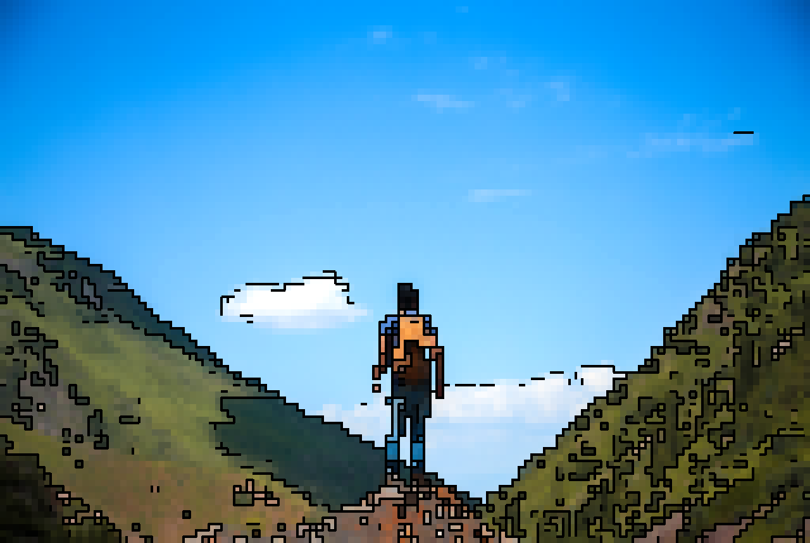
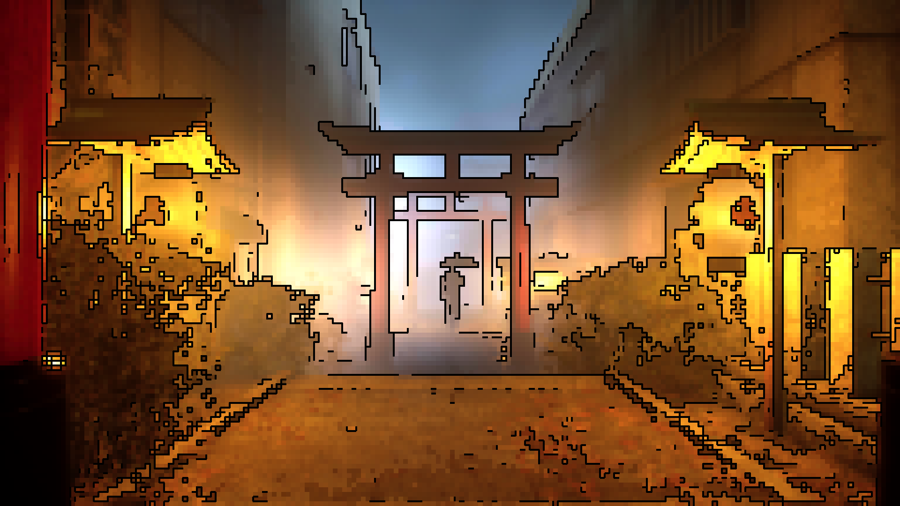

#  Photo2Pixel

---
English | [简体中文](./README_cn.md)

[Online Tool](https://coding.tools/photo2pixel) |
[Colab](https://colab.research.google.com/drive/108np4teybhBXHKbPMZZ1fykDuUeF2aw8?usp=sharing) |
[Tutorial](#Tutorial)

photo2pixel is an algorithm converting photo into pixel art. There is an [online converter coding.tools/photo2pixel](https://coding.tools/photo2pixel)
. you can try different combination of pixel size and edge threshold to get the best result.




## Prerequisites
- python3
- pytorch (for algorithm implementation)
- pillow (for image file io)
- onnx and onnxruntime (for single-file ONNX export/inference)

## Tutorial
---
photo2pixel is implemented with Pytorch, the easiest way to run it is [Colab](https://colab.research.google.com/drive/108np4teybhBXHKbPMZZ1fykDuUeF2aw8?usp=sharing),
or you can run it with command as bellow:
```bash
# use default param
python convert.py --input ./images/example_input_mountain.jpg

# or use custom param
python convert.py --kernel_size 12 --pixel_size 12 --edge_thresh 128
```

Export one configurable ONNX file and reuse it for different settings:
```bash
python export_onnx.py --output ./photo2pixel.onnx
python convert_onnx.py --model ./photo2pixel.onnx --kernel_size 12 --pixel_size 12 --edge_thresh 128
python convert_onnx.py --model ./photo2pixel.onnx --kernel_size 25 --pixel_size 8 --edge_thresh 80
```

The exported ONNX file has runtime inputs for `kernel_size`, `pixel_size`, and `edge_thresh`, so one file can be reused across config combinations.

| Parameter   |                                Description                                |    Range    |               Default               |
|-------------|:-------------------------------------------------------------------------:|:-----------:|:-----------------------------------:|
| input       |                             input image path                              |      /      | ./images/example_input_mountain.jpg |
| output      |                             output image path                             |      /      |            ./result.png             |
| kernel_size |             larger kernel size means smooth color transition              |  unlimited  |                 10                  |
| pixel_size  |                           individual pixel size                           |  unlimited  |                 16                  |
| edge_thresh | the black line in edge region, lower edge threshold means more black line |    0~255    |                 100                 |

updated by openclaw at 20260312
